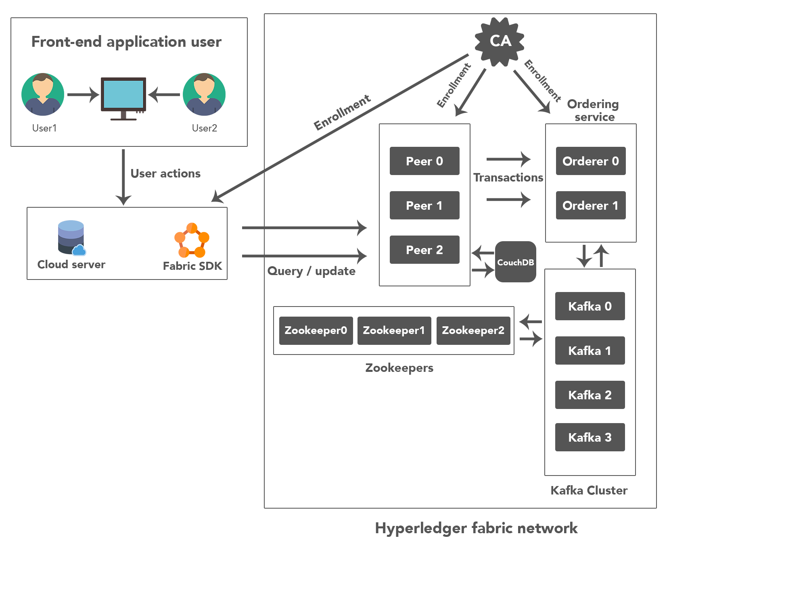
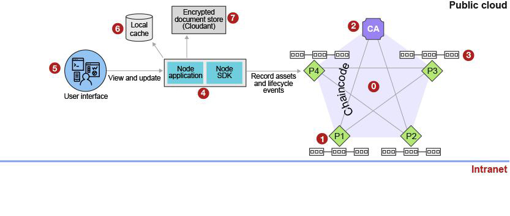
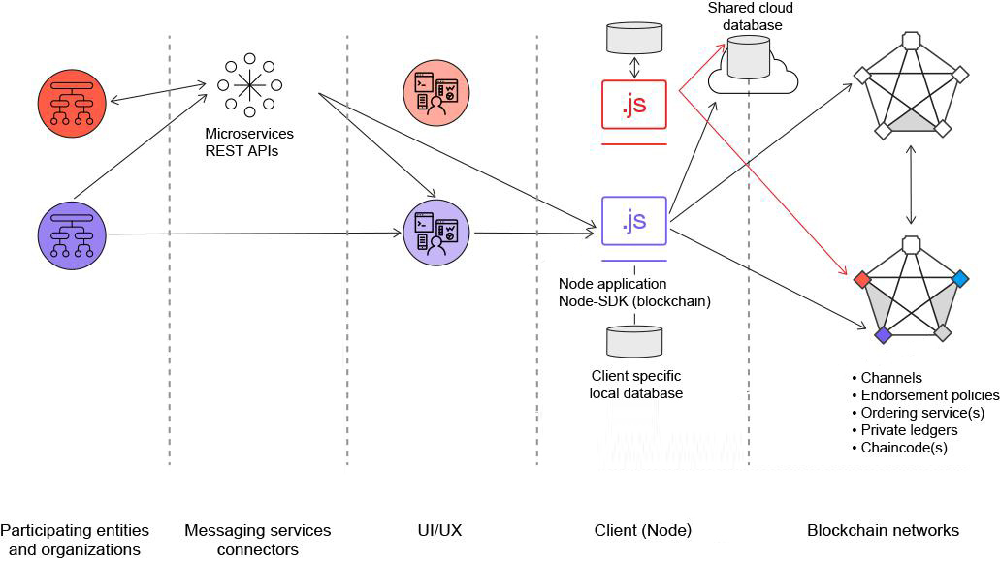

# <b>AssetChain</b>

<p align="center">
  
</p>

# BlockChain Background
### Definitions:

- **Peer** - A peer is a member of the blockchain and is running Hyperledger Fabric. From the viewpoint of AssetChain, the peers are owned and operated by [Debut Infotech Pvt. Limited](http://www.debutinfotech.com/)

- **CA**- The CA (Certificate Authority) is responsible for gatekeeping our blockchain network. It will provide transaction certificates for the clients of our AssetChain node.js application.

- **Orderer** - An orderer or ordering service is a member of the blockchain network whose main responsibility is to package transactions into blocks.

- **Users** - A user is an entity that is authorized to interact with the blockchain. In AssetChain, the user can query and write to the ledger.

- **Blocks** - Blocks contain transactions and a hash to verify integrity.

- **Transactions or Proposals** - These represent interactions to the blockchain ledger. A read or write request of the ledger is sent as a transaction/proposal.

- **Ledger** - This is the storage for the blockchain on a peer. It contains the actual block data which consist of transaction parameters and key value pairs. It is written by chaincode.

- **Chaincode** - Chaincode is Hyperledger Fabric speak for smart contracts. It defines the assets and all rules about assets.

# Application Architecture
The intent of the AssetChain was to build a limited-use, "production-ready" solution and prove the capability of the blockchain to help with asset lifecycle management issues. Hence, the team picked a set of core user stories that demonstrate business value and overcome technical challenges.

<p align="center">
  
</p>

The solution architecture addresses the following user stories:

- Record an event associated with the asset, such as purchase, inventory, assignment, disposal, and warranty.
- Device request for allocation and related workflow to avoid any discrepancies.
- Determine if device is physically damaged at any location or any event.
- Encrypt and store the original transaction or event details and record the hash of those proofs on the blockchain
- Provide the ability to view the asset lifecycle including the proofs via a user interface using various methods — by asset serial number, and by assignment.
- Data should be accessible only within the organization with private chains

AssetChain is going to manage assets between many users leveraging Hyperledger Fabric. We are going to do this in Node.js and a bit of GoLang. The backend of this application will be the GoLang code running in our blockchain network. From here on out the GoLang code will be referred to as 'chaincode'. The chaincode will be used to create assets, users etc. by storing it to the Blockchain.

## Versions
This version is compatible with Hyperledger Fabric v1.1x.
AssetChain network was successfully tested with the Hyperledger Fabric v1.1.0

## Application Communication flow
<p align="center">
  
</p>

    1. The admin will interact with AssetChain, our Node.js application, in their browser.
    2. This client side JS code will open a websocket to the backend Node.js application. The client JS will send messages to the backend when the admin interacts with the site.
    3. Reading or writing the ledger is known as a proposal. This proposal is built by AssetChain (via the SDK) and then sent to a blockchain peer.
    4. The peer will communicate to its AssetChain chaincode. The chaincode will run/simulate the transaction. If there are no issues it will endorse the transaction and send it back to our AssetChain application.
    5. AssetChain (via the SDK) will then send the endorsed proposal to the ordering service. The orderer will package many proposals from the whole network into a block. Then it will broadcast the new block to peers in the network.
    6. Finally the peer will validate the block and write it to its ledger. The transaction has now taken effect and any subsequent reads will reflect this change.

<hr>

# AssetChain Setup
## 1. Setup Local Environment
First we need to install all <b>[Prerequisites](https://hyperledger-fabric.readthedocs.io/en/release-1.1/prereqs.html)</b> for running this project. After installing all dependencies go to the next section.

## 2. Setup Chaincode

- Previously you have installed go in your system, set `GOPATH=$HOME/go/src` in your environment variables and then execute 
```
go get -u --tags nopkcs11 github.com/hyperledger/fabric/core/chaincode/shim
```
- Clone or move 
`https://github.com/debutdeveloper/asset_chain_chaincode_smartcontract ` into `$HOME/go/src/github.com/`

- You can also check the chaincode for any errors using ` go build --tags nopkcs11` command inside the debut_asset_chaincode directory.
    
## 3. Setup Network
- Clone or extract the zip of the network in your system in `$HOME`  
```
https://github.com/debutdeveloper/assetchain_blockchain_network_setup
```
- This is not a docker setup so you will require 14 machines (3 for peers, 2 for orderers, 4 for kafka broker, 3 for zookeeper, 1 for Certificate authority, 1 for couchdb).
```
firstorderer.debutinfotech.com
secondorderer.debutinfotech.com
zookeeper0
zookeeper1
zookeeper2
kafka0
kafka1
kafka2
kafka3
couchdb
peer0.debutinfotech.com
peer1.debutinfotech.com
peer2.debutinfotech.com
ca.debutinfotech.com
```
- You will have to add all these domains and ip addresses to your `/etc/hosts` file in all your machines that you need. 
- You will have to copy the network to the same location on all the peer and orderer machines that you will be working with.
- You need to clone and hyperledger fabric and fabric-ca from github into the github.com directory in your $GOPATH and run make command to create the required peer, orderer, ca etc... binaries.
- To start the peer use the `start_peer.sh` shell script.
- To start the orderer use the `start_orderer.sh` shell script.
- Then you will be required to create the channel, join all three peers [peer0.debutinfotech.com, peer1.debutinfotech.com, peer2.debutinfotech.com]() using either of the two orderers [firstorderer.debutinfotech.com, secondorderer.debutinfotech.com]().
- Then you will be required to install the chaincode on all peers and instantiate the chaincode.
- Th  two above metioned tasks can be achieved by `script.sh` file.
- You can also refer to this [blog](https://blockchain-fabric.blogspot.com/2017/09/underconstruction-setting-up-blockchain.html) for reference about the physical setup.

## 4. Setup Assetchain Api
- Clone or extract the zip of the api-sdk in your system
```
https://github.com/debutdeveloper/fabric_sdk_api.git
```
- In this cloned directory `npm install` to install all dependencies.
- First you are required to start the network, then you can start the api using `npm start` or `nodemon`.
- Then 
```
cd ./application/initialSteps/

node enrollAdmin && node registerUser
```

## 5. Setup Admin Pannel
- Clone or extract the zipped admin pannel
```
https://github.com/debutdeveloper/admin_panel
```
- In this cloned directory `npm install` to install all dependencies.
- You will have to set the ip address of your api in the configuration file of the admin panel.
- First you are required to start the api-sdk, then you can start the admin pannel using `npm start` or `nodemon`.
<hr>

# Using AssetChain
1. <b>Admin Panel</b> can be accessed by this url [assetchain.debutinfotech.com](http://assetchain.debutinfotech.com)
 
2. <b>Mobile app</b> to access AssetChain can be downloaded from the [Google Play store](https://play.google.com/store/apps/details?id=com.flutter.debutassets) and the [Apple App store](https://itunes.apple.com/us/app/id1391618573)

<hr>

<!--
# AssetChain FAQs
Do you have questions about why something in AssetChain is the way it is? Or how to do something? Check out the [FAQ]().
<hr>

# Feedback

We are very interested in your feedback. 
If you have any ideas on how to improve the project, please reach out! Specifically:

    -Did the format of the readme work well for you?
    -At which points did you get lost?
    -Is something broken!?
    -Did your knowledge grow by the end of the tutorial?
    -Was something particularly painful?
    -Did it make you have an existential crisis and you -are suddenly unsure of what it means to be, you?

<!-- Use the [GitHub Issues]() section to communicate any improvements/bugs and pain points! -->

